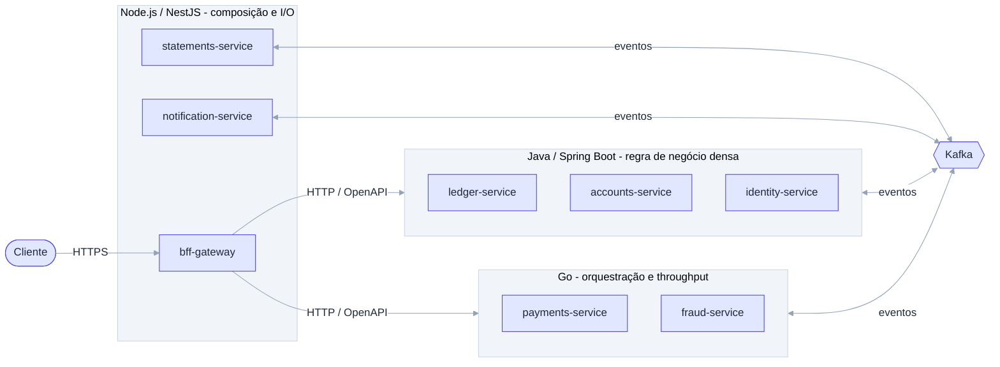

# ADR-003: Adotar microsserviços poliglotas (Java, Go e Node.js) divididos por papel

- **Data**: 2026-10-01
- **Status**: Accepted
- **Deciders**: Samuel Santana
- **Tags**: arquitetura, stack, microsserviços

## Contexto e problema

O harness precisa ser testado contra mais de um ecossistema de build, teste
e lint, e a pergunta central do projeto envolve mudar um serviço sem quebrar
os vizinhos. Um monolito, ou uma única stack, não exercita fronteiras de
serviço nem a capacidade do harness de lidar com convenções diferentes.

## Decision Drivers

- Poliglota por motivo real, não forçado.
- Três ecossistemas de build/teste/lint para o harness cobrir.
- Cada stack deve ser usada onde é mais adequada ao papel do serviço.
- Escopo controlável: núcleo mínimo de 5 serviços, MVP de 8.

## Considered Options

- Monolito modular em uma única stack
- Microsserviços em uma única stack (ex.: só Java)
- Microsserviços poliglotas divididos por papel

## Decision Outcome

Opção escolhida: **microsserviços poliglotas divididos por papel**:

- **Java / Spring Boot** onde a regra de negócio é densa: `ledger-service`,
  `accounts-service`, `identity-service`.
- **Go** onde há orquestração e throughput: `payments-service`,
  `fraud-service`.
- **Node.js (NestJS)** onde há composição e I/O: `bff-gateway`,
  `statements-service`, `notification-service`.

Serviços (exceto `bff-gateway`) são nomeados `*-service`.

### Consequências positivas

- Harness é forçado a lidar com três convenções de código e teste.
- Cada serviço tem fronteira real, o que torna violações de contrato
  detectáveis.

### Consequências negativas

- Três toolchains para manter (templates, CI, Dockerfiles).
- Boilerplate duplicado entre serviços da mesma stack.
- Sem bibliotecas compartilhadas entre stacks; contratos viram a única
  cola (ver [ADR-007](007-monorepo-com-contratos-compartilhados-e-sem-imports-entre-servicos.md)).

## Pros and Cons of the Options

### Poliglota por papel ✅ Chosen

- ✅ Exercita o harness em três ecossistemas
- ❌ Custo operacional e de manutenção maior

### Uma única stack

- ✅ Simples, convenções uniformes
- ❌ Não prova que o harness funciona entre stacks

### Monolito modular

- ✅ Rápido de gerar
- ❌ Sem fronteiras reais, sem contratos entre serviços para violar

## Diagrama (C4 Container simplificado)

## Links

- Documento inicial — seção "Catálogo de microserviços"
- [ADR-001](001-documentacao-de-contexto-por-servico.md)
