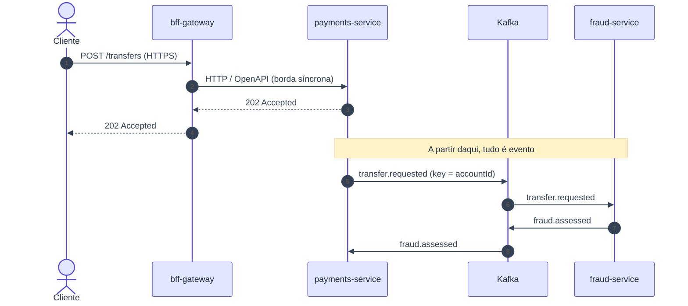

# ADR-004: Comunicação assíncrona via Kafka entre serviços, síncrona apenas na borda

- **Data**: 2026-10-01
- **Status**: Accepted
- **Deciders**: Samuel Santana
- **Tags**: arquitetura, mensageria, kafka, api

## Contexto e problema

Serviços que se chamam de forma síncrona acumulam acoplamento temporal e
falhas em cascata, e um fluxo como a transferência atravessa vários
serviços. Precisamos definir como os serviços se comunicam, de modo que
contratos sejam explícitos e verificáveis.

## Decision Drivers

- Desacoplamento entre serviços e tolerância a falhas parciais.
- Ordem por conta e reprocessamento (replay) de eventos.
- Contratos versionados que um sensor possa checar.
- Único ponto de entrada para clientes externos.

## Considered Options

- REST síncrono entre todos os serviços
- Eventos no Kafka entre serviços; REST/OpenAPI só na borda (BFF → serviços)
- Mensageria com RabbitMQ

## Decision Outcome

Opção escolhida: **chamadas síncronas só na borda (BFF → serviços);
entre serviços, tudo é evento no Kafka**. Kafka permite ordem por
partição, replay (necessário para projeções como `statements-service`) e
múltiplos consumidores do mesmo evento.

Convenções: chave de partição = id da conta; toda mensagem carrega
`eventId` e `correlationId`; schemas versionados em `contracts/events/`;
APIs síncronas em `contracts/openapi/`.

### Consequências positivas

- Serviços desacoplados no tempo; evento novo não obriga mudar produtores.
- Replay habilita read-models e projeções.
- Contratos em `contracts/` viram fonte da verdade.

### Consequências negativas

- Consistência eventual; fluxos exigem saga e compensação (ver
  [ADR-006](006-saga-de-transferencia-orquestrada-por-payments-service.md)).
- Depuração mais difícil; depende de `correlationId`.
- Kafka é dependência pesada para o ambiente local.
- Formato do contrato (Avro/Schema Registry ou JSON Schema) ainda em
  aberto e fora deste ADR.

## Pros and Cons of the Options

### Kafka + REST só na borda ✅ Chosen

- ✅ Ordem por partição, replay, desacoplamento
- ❌ Consistência eventual, mais infra

### REST síncrono entre serviços

- ✅ Simples de entender
- ❌ Acoplamento temporal, falha em cascata, sem replay

### RabbitMQ

- ✅ Mais leve de operar
- ❌ Sem log retido para replay; ordem por conta menos natural

## Diagrama (síncrono na borda, assíncrono no núcleo)

## Links

- Documento inicial — seção "Arquitetura e estrutura do monorepo"
- [ADR-005](005-outbox-pattern-para-publicacao-de-eventos.md)
- [ADR-008](008-consumidores-idempotentes-e-particionamento-por-conta.md)
