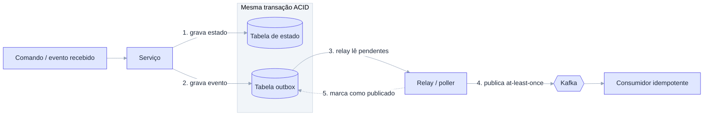

# ADR-005: Publicar eventos via outbox pattern

- **Data**: 2026-10-01
- **Status**: Accepted
- **Deciders**: Samuel Santana
- **Tags**: arquitetura, kafka, consistência

## Contexto e problema

Serviços com banco próprio precisam gravar estado e publicar o evento
correspondente. Gravar no banco e publicar no Kafka como duas operações
independentes (dual-write) pode perder mensagem ou publicar evento de
transação que sofreu rollback, o que quebra invariantes financeiras.

## Decision Drivers

- Nenhuma mensagem pode ser perdida entre estado gravado e evento publicado.
- Regra uniforme que o harness consiga verificar e ensinar ao agente.
- Evitar transações distribuídas (2PC).

## Considered Options

- Dual-write direto (banco + Kafka)
- Outbox pattern (evento gravado na mesma transação, publicado por relay)
- Event sourcing completo

## Decision Outcome

Opção escolhida: **outbox pattern** para todo serviço que possui banco e
publica eventos (ledger, payments, accounts, identity etc.). O evento é
gravado numa tabela outbox na mesma transação do estado e um relay o
publica no Kafka. Dual-write direto é proibido.

### Consequências positivas

- Atomicidade entre estado e evento sem 2PC.
- Garantia at-least-once, combinando com consumidores idempotentes
  ([ADR-008](008-consumidores-idempotentes-e-particionamento-por-conta.md)).

### Consequências negativas

- Entrega duplicada possível; consumidores precisam deduplicar.
- Componente extra (relay/poller ou CDC) por serviço.
- Latência adicional entre commit e publicação.

## Pros and Cons of the Options

### Outbox ✅ Chosen

- ✅ Atômico, simples, independe de 2PC
- ❌ Relay para operar; at-least-once

### Dual-write

- ✅ Simples
- ❌ Perde ou inventa eventos em falha parcial

### Event sourcing completo

- ✅ Eventos são a fonte da verdade
- ❌ Complexidade muito maior; o ledger já é append-only por design

## Diagrama

## Links

- [ADR-004](004-comunicacao-assincrona-via-kafka-e-sincrona-apenas-na-borda.md)
- [ADR-006](006-saga-de-transferencia-orquestrada-por-payments-service.md)
