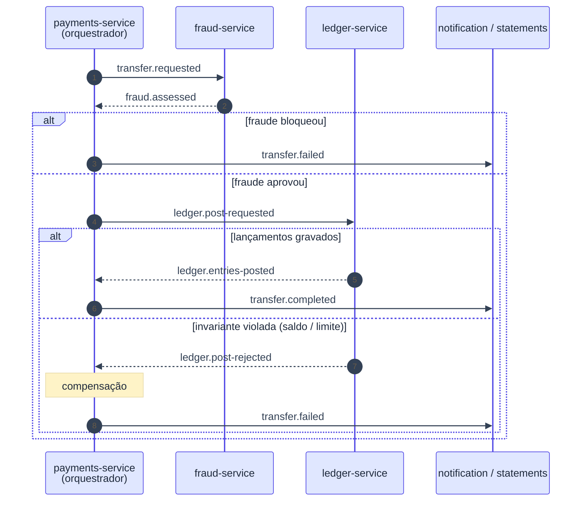

# ADR-006: Saga de transferência orquestrada por payments-service

- **Data**: 2026-10-01
- **Status**: Accepted
- **Deciders**: Samuel Santana
- **Tags**: saga, payments, orquestração

## Contexto e problema

Uma transferência atravessa fraud, ledger, accounts, statements e
notification, sem transação distribuída. É preciso coordenar os passos e
compensar quando um deles falha (ex.: `ledger.post-rejected`). Precisamos
decidir quem detém o fluxo.

## Decision Drivers

- Fluxo explícito, em um só lugar, mais fácil de ensinar ao agente.
- Estados e compensações verificáveis.
- Idempotência e retry controlados.

## Considered Options

- Saga orquestrada (payments-service como orquestrador)
- Saga coreografada (cada serviço reage a eventos dos outros)

## Decision Outcome

Opção escolhida: **saga orquestrada**, com `payments-service` (Go) como
orquestrador. Fluxo:

`transfer.requested` → fraud → `fraud.assessed` → `ledger.post-requested`
→ ledger → `ledger.entries-posted` ou `ledger.post-rejected` →
`transfer.completed` ou `transfer.failed` (compensado).

Payments mantém estado da saga, idempotência e compensação, publicando via
outbox ([ADR-005](005-outbox-pattern-para-publicacao-de-eventos.md)).

### Consequências positivas

- Lógica do fluxo concentrada; novo passo da saga é mudança em um serviço
  mais contratos.
- Estados e compensações testáveis em um lugar.

### Consequências negativas

- `payments-service` vira ponto de acoplamento e de risco (complexidade 5);
  exige revisão humana linha a linha.
- Ledger e fraud dependem do contrato definido pelo orquestrador.

## Pros and Cons of the Options

### Orquestrada ✅ Chosen

- ✅ Fluxo visível, compensação centralizada, simples para o agente
- ❌ Orquestrador concentra conhecimento

### Coreografada

- ✅ Menor acoplamento ao centro
- ❌ Fluxo espalhado e difícil de raciocinar; compensação difusa

## Diagrama (sequência da saga)

## Links

- Documento inicial — seção "Saga de transferência e seus eventos" e
  tabela de decisões em aberto
- [ADR-004](004-comunicacao-assincrona-via-kafka-e-sincrona-apenas-na-borda.md)
