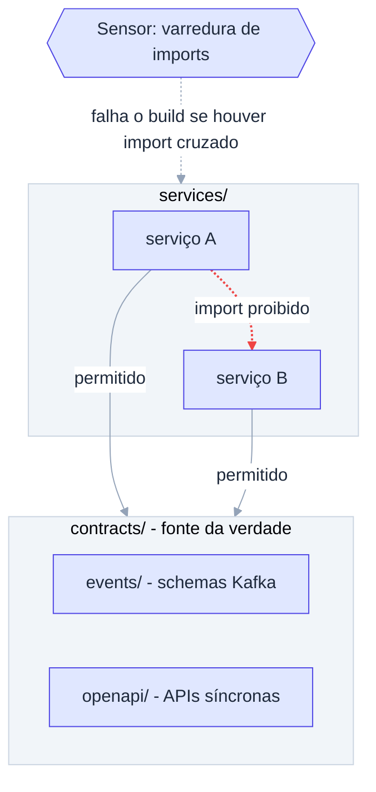

# ADR-007: Monorepo com contratos compartilhados e sem imports entre serviços

- **Data**: 2026-10-01
- **Status**: Accepted
- **Deciders**: Samuel Santana
- **Tags**: monorepo, contratos, guardrail

## Contexto e problema

Queremos simular a independência de repositórios separados sem o custo de
manter vários repos. Se um serviço importar código de outro, as fronteiras
se dissolvem e o experimento deixa de medir se o agente respeita
contratos.

## Decision Drivers

- Simular multirepo dentro de um monorepo.
- Contratos como fonte da verdade (código segue o contrato).
- Regra verificável por sensor.
- Uma só base de código para o harness cobrir.

## Considered Options

- Multirepo real, um repositório por serviço
- Monorepo sem restrição de imports
- Monorepo com regra de não-import entre serviços e `contracts/` compartilhado

## Decision Outcome

Opção escolhida: **monorepo com `contracts/` compartilhado e regra de que
um serviço nunca importa código de outro**. Estrutura: `contracts/events/`
(schemas Kafka), `contracts/openapi/` (APIs síncronas), `services/*`
(build, testes, Dockerfile e `AGENTS.md` próprios), `platform/`
(docker-compose, Makefile) e `harness/`. Um sensor de varredura de
dependências e imports falha o build em caso de violação.

### Consequências positivas

- Fronteiras reais e checáveis; violação vira falha de CI local.
- Harness e contratos versionados juntos com o código.

### Consequências negativas

- Código comum (ex.: clientes de contrato) é gerado ou duplicado, não
  compartilhado.
- Sensor precisa suportar as três stacks.
- Disciplina é convenção até o sensor existir.

## Pros and Cons of the Options

### Monorepo + regra + contracts ✅ Chosen

- ✅ Barato de operar, fronteiras verificáveis
- ❌ Depende do sensor para impor a regra

### Multirepo real

- ✅ Isolamento total
- ❌ Overhead alto para um testbed; harness cross-service difícil

### Monorepo sem restrição

- ✅ Mais simples
- ❌ Acoplamento silencioso; descaracteriza o experimento

## Diagrama (regra de dependência)

## Links

- Documento inicial — seção "Arquitetura e estrutura do monorepo"
- [ADR-003](003-microservicos-poliglotas-java-go-node.md)
- [ADR-001](001-documentacao-de-contexto-por-servico.md)
