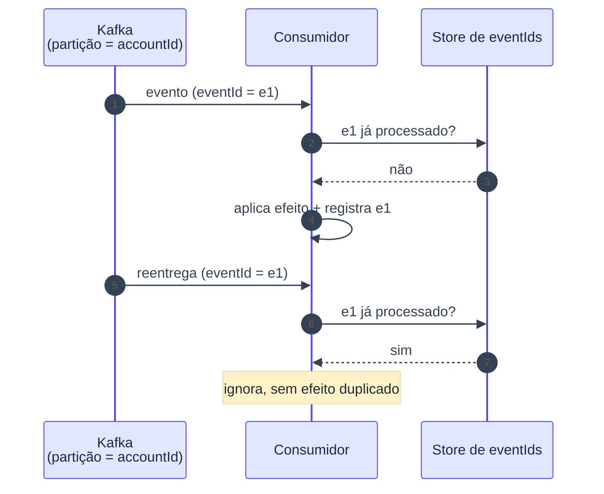

# ADR-008: Consumidores idempotentes por eventId e particionamento por id da conta

- **Data**: 2026-10-01
- **Status**: Accepted
- **Deciders**: Samuel Santana
- **Tags**: kafka, idempotência, ordenação

## Contexto e problema

Com outbox ([ADR-005](005-outbox-pattern-para-publicacao-de-eventos.md)) e
Kafka, a entrega é at-least-once: o mesmo evento pode chegar mais de uma
vez. Num sistema financeiro, processar duas vezes um lançamento viola o
ledger; processar fora de ordem para a mesma conta gera saldo inconsistente.

## Decision Drivers

- Reprocessamento seguro, sem efeito duplicado.
- Ordem preservada por conta.
- Regra simples e testável por sensor.

## Considered Options

- Entrega exactly-once do Kafka (transações) sem deduplicação no consumidor
- Consumidores idempotentes por `eventId` + chave de partição = id da conta
- Particionamento aleatório, ordenação resolvida no consumidor

## Decision Outcome

Opção escolhida: **toda mensagem carrega `eventId` e `correlationId`;
consumidores são idempotentes por `eventId`; a chave de partição é o id da
conta**, garantindo ordem por conta. Sensor: teste que reentrega o mesmo
`eventId` duas vezes.

### Consequências positivas

- Redelivery e replay seguros.
- Ordem por conta sem coordenação extra.
- `notification-service` serve de baseline simples do padrão.

### Consequências negativas

- Cada consumidor guarda estado de deduplicação (tabela ou chave).
- Ordem só é garantida dentro da conta; fluxos entre contas não têm ordem
  global.
- Hot accounts podem causar partições desbalanceadas.

## Pros and Cons of the Options

### Idempotência + chave por conta ✅ Chosen

- ✅ Simples, robusto, testável
- ❌ Estado de dedup por consumidor

### Exactly-once do Kafka apenas

- ✅ Menos código no consumidor
- ❌ Não cobre efeitos fora do Kafka (banco, notificações)

### Ordenação no consumidor

- ✅ Flexível
- ❌ Complexo e propenso a erro

## Diagrama (reentrega do mesmo eventId)

## Links

- [ADR-004](004-comunicacao-assincrona-via-kafka-e-sincrona-apenas-na-borda.md)
- [ADR-005](005-outbox-pattern-para-publicacao-de-eventos.md)
