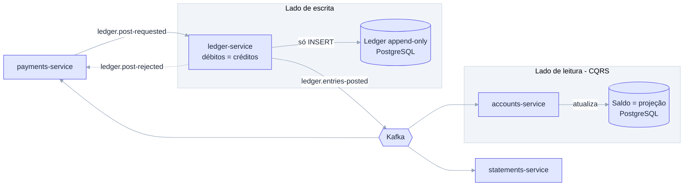

# ADR-009: Ledger de partidas dobradas append-only e saldo como projeção (CQRS)

- **Data**: 2026-10-01
- **Status**: Accepted
- **Deciders**: Samuel Santana
- **Tags**: ledger, cqrs, invariantes

## Contexto e problema

O saldo é o dado mais sensível do sistema. Precisamos de uma fonte da
verdade auditável e, ao mesmo tempo, de leitura rápida de saldo e limites
para quem consulta contas.

## Decision Drivers

- Invariante central: débitos = créditos, nunca update, só append.
- Auditabilidade e reconstrução do saldo.
- Separação entre escrita e leitura.
- Invariante verificável por property-based tests.

## Considered Options

- Tabela de contas com coluna de saldo atualizada in-place
- Ledger append-only de partidas dobradas como fonte da verdade, com saldo
  como projeção em `accounts-service` (CQRS)
- Event sourcing completo em todos os serviços

## Decision Outcome

Opção escolhida: **`ledger-service` (Java, PostgreSQL) mantém um ledger
imutável de partidas dobradas, fonte da verdade do saldo; o
`accounts-service` mantém o saldo como projeção** construída a partir de
`ledger.entries-posted` (CQRS: escrita no ledger, leitura em accounts).
Violações de invariante geram `ledger.post-rejected`.

### Consequências positivas

- Histórico completo e auditável; estornos são novos lançamentos.
- Invariante central é testável com property-based tests.
- Leitura de saldo desacoplada da escrita.

### Consequências negativas

- Saldo em accounts é eventualmente consistente.
- Correções exigem lançamentos compensatórios, não edição.
- Projeção precisa ser reconstruível por replay e mantida em sincronia.

## Pros and Cons of the Options

### Ledger append-only + projeção ✅ Chosen

- ✅ Auditável, invariante clara, leitura escalável
- ❌ Consistência eventual no saldo exibido

### Saldo atualizado in-place

- ✅ Simples
- ❌ Sem histórico confiável; fácil de corromper

### Event sourcing completo

- ✅ Uniforme
- ❌ Complexidade desnecessária fora do ledger

## Diagrama (escrita no ledger, leitura em accounts)

## Links

- Documento inicial — catálogo de serviços (ledger, accounts)
- [ADR-006](006-saga-de-transferencia-orquestrada-por-payments-service.md)
- [ADR-005](005-outbox-pattern-para-publicacao-de-eventos.md)
