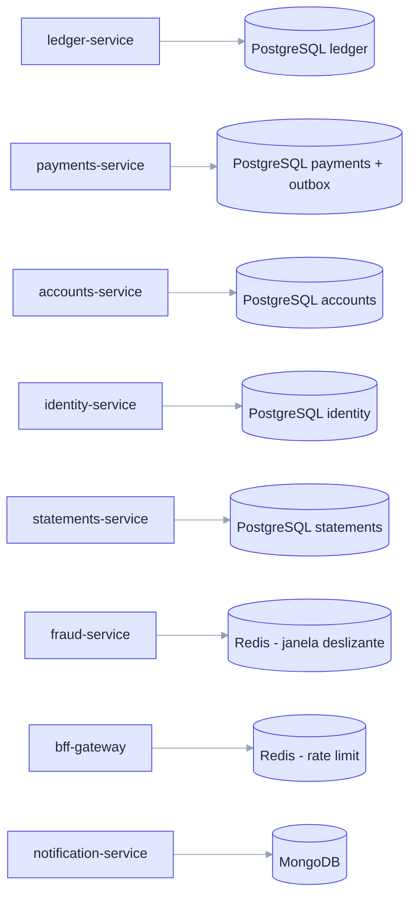

# ADR-010: Banco de dados por serviço com persistência poliglota

- **Data**: 2026-10-01
- **Status**: Accepted
- **Deciders**: Samuel Santana
- **Tags**: dados, postgresql, redis, mongodb

## Contexto e problema

Serviços independentes ([ADR-003](003-microservicos-poliglotas-java-go-node.md))
não podem compartilhar esquema sem acoplar-se pelo banco. Além disso, os
perfis de dados diferem: ledger exige ACID, fraud exige estado de janela
deslizante com baixa latência, notification guarda documentos com retry.

## Decision Drivers

- Isolamento de dados entre serviços (sem leitura cruzada de tabelas).
- Adequação do armazenamento ao perfil de acesso.
- Ambiente local simples via `docker compose`.

## Considered Options

- Banco compartilhado único (PostgreSQL)
- Um banco por serviço, tecnologia escolhida pelo perfil de dados

## Decision Outcome

Opção escolhida: **banco por serviço, com a tecnologia escolhida pelo
perfil**:

- **PostgreSQL**: ledger, payments (+ outbox), accounts, identity,
  statements.
- **Redis**: fraud (janela deslizante), bff-gateway (rate limit).
- **MongoDB**: notification (templates, tentativas, DLQ).

Nenhum serviço lê ou escreve no banco de outro; integração só por
eventos e contratos.

### Consequências positivas

- Fronteiras de dados reais; mudança de esquema local a um serviço.
- Cada serviço usa o armazenamento mais adequado.

### Consequências negativas

- Sem joins entre domínios; dados cruzados via projeções/eventos.
- Quatro tecnologias de dados para operar localmente.
- Backup e migração por serviço.

## Pros and Cons of the Options

### Banco por serviço ✅ Chosen

- ✅ Isolamento, escolha adequada de tecnologia
- ❌ Mais infra, sem consultas cruzadas

### Banco compartilhado

- ✅ Simples, joins fáceis
- ❌ Acopla serviços pelo esquema; invalida o experimento

## Diagrama (serviço → banco)

## Links

- Documento inicial — catálogo de serviços (coluna "Dados")
- [ADR-004](004-comunicacao-assincrona-via-kafka-e-sincrona-apenas-na-borda.md)
